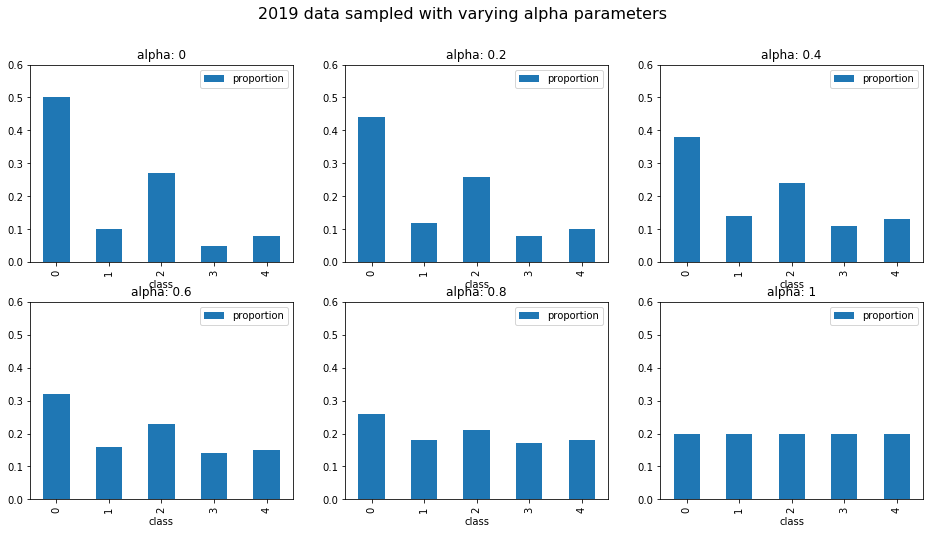
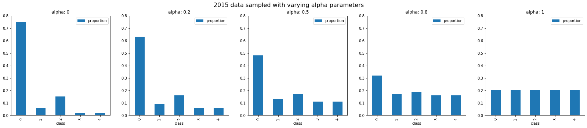

===================================================================================================
`Aptos 2019 Blindness Detection <https://www.kaggle.com/c/aptos2019-blindness-detection/overview>`_
===================================================================================================

.. contents:: Table of Contents
   :depth: 2

Report
======

I received a silver medal for coming in `89th place (top 3%) <https://www.kaggle.com/c/aptos2019-blindness-detection/leaderboard>`_.

Below I'll detail some of the things I tried throughout the competition.

Sampling Strategy
-----------------
The data for this competition had quite imbalanced classes, so I wrote a custom ``PyTorch``
``BatchSampler`` to help with this problem.

Class Balancing
---------------
Based on the choice of an ``alpha`` parameter in ``[0, 1]`` the sampler would adjust the sample
distribution to be between true distribution (``alpha = 0``), and a uniform distribution
(``alpha = 1``).

Overrepresented classes would be undersampled, and underrepresented classes oversampled.

Note the extreme imbalance for the 2015 data.

Typically for training on the 2015 data I used an ``alpha`` value of 0.8, and for fine-tuning on
the 2019 data I used alpha values in the range 0.2 to 0.8.

Standardised Batches
--------------------
Each sample generated would contain exactly the specified proportion of classes.

Here are a few sample batches of labels from a sampler with `alpha = 0.5` and `batch_size = 32`

.. code::

    Batch: 0
    Classes: [1, 0, 0, 0, 2, 4, 0, 2, 0, 0, 3, 2, 1, 0, 2, 0, 0, 3, 0, 0, 4, 4, 0, 2, 1, 3, 3, 1, 2, 0, 0, 4]
    Counts: {0: 14, 1: 4, 2: 6, 3: 4, 4: 4}

    Batch: 1
    Classes: [4, 1, 1, 2, 0, 0, 0, 4, 2, 4, 0, 3, 1, 3, 0, 0, 3, 2, 0, 2, 4, 2, 0, 0, 2, 3, 0, 1, 0, 0, 0, 0]
    Counts: {0: 14, 1: 4, 2: 6, 3: 4, 4: 4}

    Batch: 2
    Classes: [0, 4, 0, 0, 0, 3, 3, 2, 0, 4, 2, 3, 0, 3, 2, 0, 0, 1, 2, 2, 0, 1, 0, 0, 4, 0, 2, 1, 1, 4, 0, 0]
    Counts: {0: 14, 1: 4, 2: 6, 3: 4, 4: 4}

Note that the class counts are the same for each batch.

User Guide
==========

Requirements
------------
* Python >= 3.6
* PyTorch >= 1.1
* Tensorboard >= 1.4

Folder Structure
----------------

::

  aptos2019-blindness-detection/
  │
  ├── aptos/
  │    │
  │    ├── cli.py - command line interface
  │    ├── main.py - main script to start train/test
  │    │
  │    ├── base/ - abstract base classes
  │    │   ├── base_model.py - abstract base class for models
  │    │   └── base_trainer.py - abstract base class for trainers
  │    │
  │    ├── data_loader/ - anything about data loading goes here
  │    │   └── data_loaders.py
  │    │
  │    ├── model/ - models, losses, and metrics
  │    │   ├── loss.py
  │    │   ├── metric.py
  │    │   └── model.py
  │    │
  │    ├── trainer/ - trainers
  │    │   └── trainer.py
  │    │
  │    └── utils/
  │        ├── logger.py - class for train logging
  │        ├── visualization.py - class for Tensorboard visualization support
  │        └── saving.py - manages pathing for saving models + logs
  │
  ├── logging.yml - logging configuration
  │
  ├── data/ - directory for storing input data
  │
  ├── experiments/ - directory for storing configuration files
  │
  ├── saved/ - directory for checkpoints and logs
  │
  └── tests/ - tests folder

Usage
-----

.. code-block:: bash

  $ conda env create --file environment.yml
  $ conda activate aptos

See ``notebooks/preprocess.ipynb`` to preprocess the data for training.

To start training, run:

.. code-block:: bash

  $ aptos train -c experiments/config.yml

Tensorboard Visualization
~~~~~~~~~~~~~~~~~~~~~~~~~
This template supports `<https://pytorch.org/docs/stable/tensorboard.html>`_ visualization.

1. Run training

    Set `tensorboard` option in config file true.

2. Open tensorboard server

    Type `tensorboard --logdir saved/runs/` at the project root, then server will open at
    `http://localhost:6006` (if clicking the link doesn't work, paste this into your browser)

