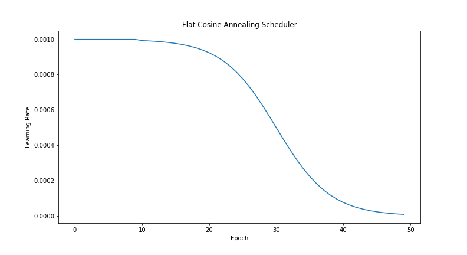
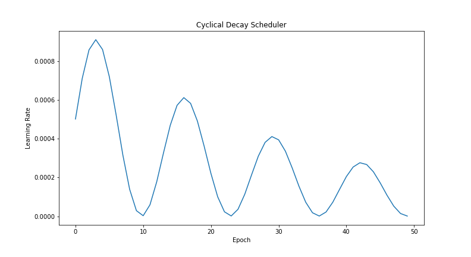
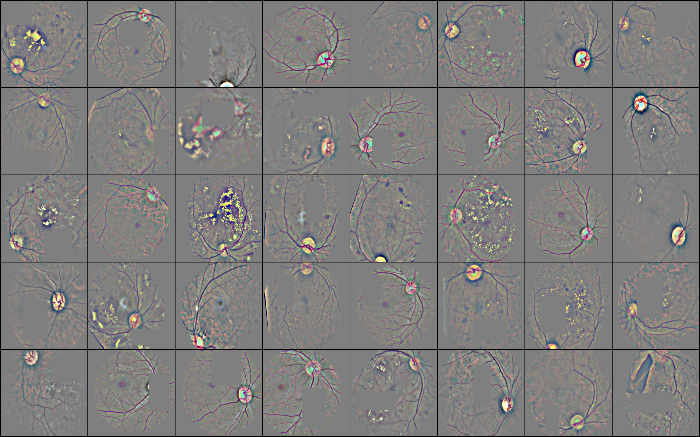
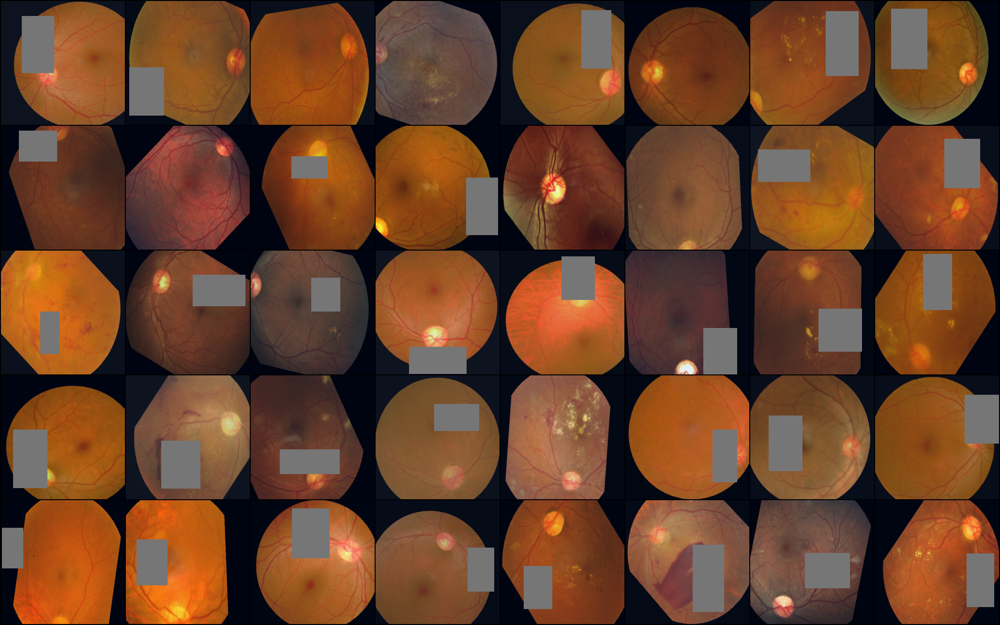
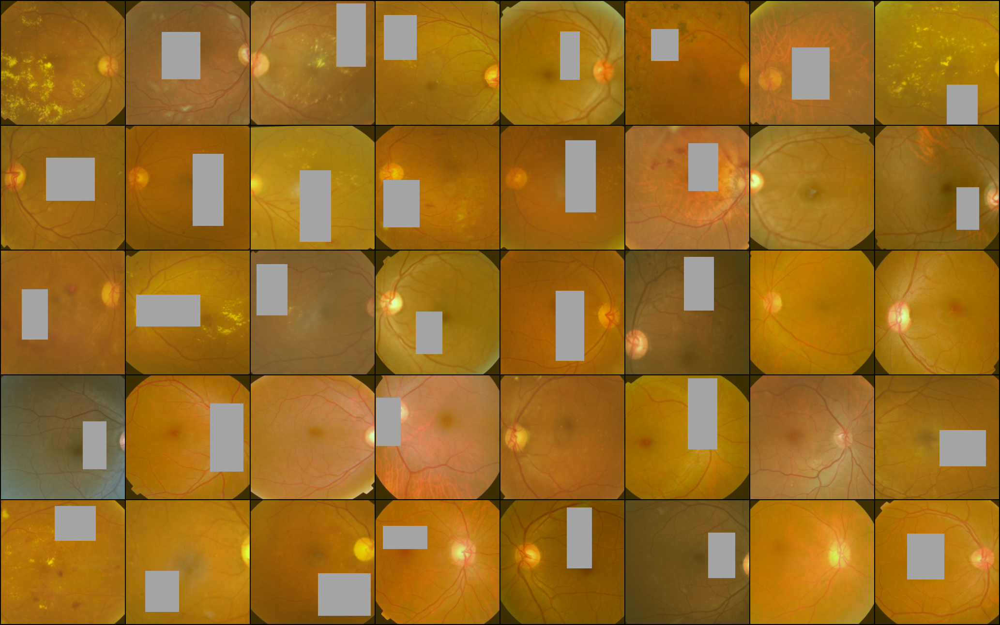
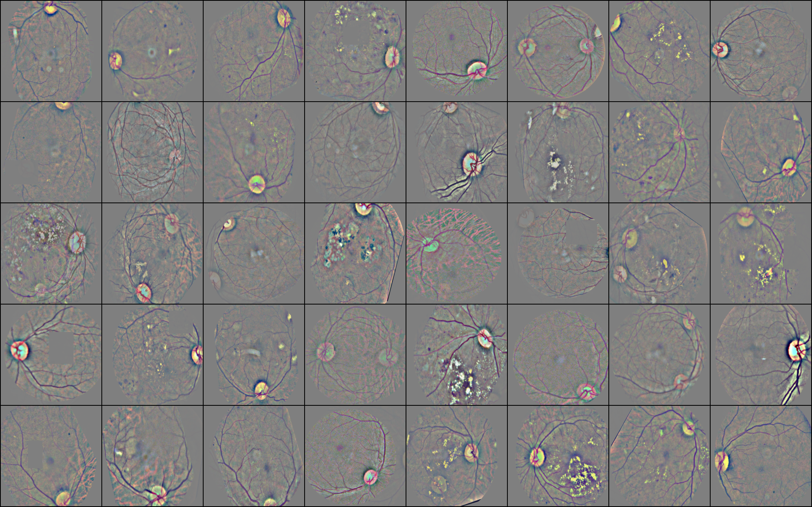
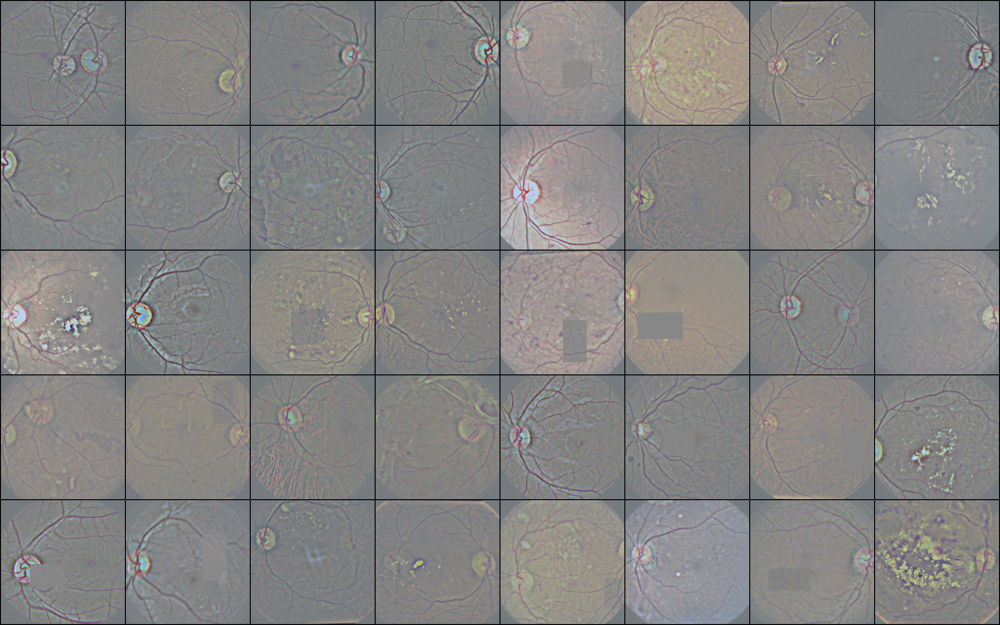
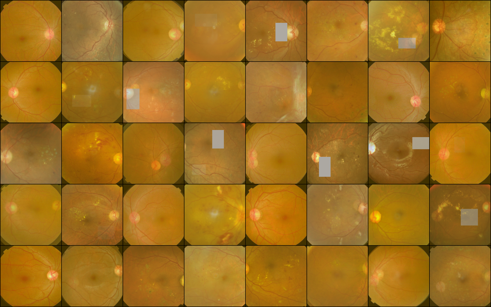

===================================================================================================
`Aptos 2019 Blindness Detection <https://www.kaggle.com/c/aptos2019-blindness-detection/overview>`_
===================================================================================================

*"Millions of people suffer from diabetic retinopathy, the leading cause of blindness among working
aged adults. Aravind Eye Hospital in India hopes to detect and prevent this disease among people
living in rural areas where medical screening is difficult to conduct."*

This competition was a lot of fun and gave me the opportunity to explore a variety of ML techniques.

.. contents:: **Table of Contents**
   :depth: 3

Competition Report
==================

Results
-------
89th/2987 | Top 3% | Silver Medal

# TODO: public v private LB scores

Overview
--------

1. `EfficientNet <https://github.com/lukemelas/EfficientNet-PyTorch>`_ (pretrained on ImageNet)
2. Regression
3. Variety of preprocessing/augmentation techniques
4. Train on 2015 train + test data
5. Fine-tune on 2019 data
6. Ensemble 5 models

Network + Training Loop
-----------------------

Architecture
~~~~~~~~~~~~
I primarily used ``EfficientNet-b2``. I experimented with the ``b3`` but didn't notice a
significant improvement, and larger models were limited by using my GPU at home.

I tried using `Apex <https://github.com/NVIDIA/apex>`_ to train using half-precision but had
problems saving/loading models, and problems installing ``Apex`` in the Kaggle kernels.

Loss
~~~~
Participants had a choice in this competition to approach it as classification or regression
problem. I had best results treating it as a regression problem with ``MSE``.

Other things I tried:

1. `Robust Loss <https://github.com/jonbarron/robust_loss_pytorch>`_, which was introduced at CVPR
recently.

2. `Wassertein metric <https://en.wikipedia.org/wiki/Wasserstein_metric>`_ AKA
`Earth Mover's Distance <https://en.wikipedia.org/wiki/Earth_mover%27s_distance>`_. I couldn't find
a good implementation of it so I wrote my own. It seemed to work - but didn't perform better than
``MSE``.

Some competitors had success with ordinal classification, or using a mixed loss function.

Optimizer
~~~~~~~~~
I experimented with ``Adam``, ``RMSProp``, and ``SGD`` early on and found ``Adam`` to perform best.

Later on I switched to using
`Ranger <https://github.com/lessw2020/Ranger-Deep-Learning-Optimizer>`_, which is
``RAdam`` + ``LookAhead``.

LR Scheduler
~~~~~~~~~~~~
I implemented some custom LR schedulers and found Flat Cosine Annealing to work best:

.. image:: ./resources/slow-start-cosine-annealing-scheduler.png

Noisy Labels
~~~~~~~~~~~~
I figured that with >80,000 images in the 2015 dataset and heavy augmentation I could train for
many epochs. In order to guard against overfitting and smooth out the regression target labels,
I added some normally distributed noise (mean=0, std=0.1) to the labels. I found this helped
slightly although it was difficult to evaluate given the uncertainty around public LB scores.

Data
----
I pretrained on the train + test data from 2015, before fine-tuning on the 2019 training set.

Image Size
~~~~~~~~~~
While I experimented a little with image size, almost all models I trained used ``256x256`` images.

Many of the best submissions used a variety of image sizes, and often much larger images. I should
do this in future competitions.

Preprocessing & Augmentation
~~~~~~~~~~~~~~~~~~~~~~~~~~~~
I used a variety of preprocessing and augmentation techniques, outlined below.

Ben's Cropping
**************
I started out by using a technique similar to the
`winner of the 2015 competition <https://www.kaggle.com/c/diabetic-retinopathy-detection/discussion/15801#latest-370950>`_.

Early on in the competition I got to rank 8 with this model (Public 0.781, Private 0.902).

Circle Crop
***********
I tried a simple circle crop, which led to my best performing single model
(Public 0.791, Private 0.913).

Tight Crop
**********
The test set images looked quite different from the training set, so I tried a *tight* cropping
method to try to make the training examples more similar to the test set. I implemented this on the
final day of the competition and didn't use a submission to evaluate it independently - I just took
a chance and included it in my final ensemble.

Mixup
*****
I implemented mixup hoping to smooth out the distribution of regression targets. When an image was
selected by the sampler I would mix it with a random image from a neighbouring class, choosing a
blend parameter from a Beta distribution (0.4, 0.4).

I tried this with some different preprocessing techniques as shown below, but found it yielded
poor results (Public 0.760, Private 0.908). Other contestants who tried mixup also reported poor
results. Thinking about it now, the private LB score is actually not bad for a single model - I
probably gave up on this prematurely because of the low public LB score.

Sampling Strategy
~~~~~~~~~~~~~~~~~
The data for this competition had quite imbalanced classes, so I wrote a custom ``PyTorch``
``BatchSampler`` to help with this problem.

See ``aptos.data_loader.sampler`` for implementation details.

Class Balancing
***************
Based on the choice of an ``alpha`` parameter in ``[0, 1]`` the sampler would adjust the sample
distribution to be between true distribution (``alpha = 0``), and a uniform distribution
(``alpha = 1``).

Overrepresented classes would be undersampled, and underrepresented classes oversampled.

.. image:: ./resources/sample-distributions-2019-data.png

Note the extreme imbalance for the 2015 data.

.. image:: ./resources/sample-distributions-2015-data.png

Typically for training on the 2015 data I used an ``alpha`` value of 0.8, and for fine-tuning on
the 2019 data I used alpha values in the range 0.2 to 0.8.

Standardised Batches
********************
Each sample generated would contain exactly the specified proportion of classes.

Here are a few sample batches of labels from a sampler with ``alpha = 0.5`` and ``batch_size = 32``

.. code::

    Batch: 0
    Classes: [1, 0, 0, 0, 2, 4, 0, 2, 0, 0, 3, 2, 1, 0, 2, 0, 0, 3, 0, 0, 4, 4, 0, 2, 1, 3, 3, 1, 2, 0, 0, 4]
    Counts: {0: 14, 1: 4, 2: 6, 3: 4, 4: 4}

    Batch: 1
    Classes: [4, 1, 1, 2, 0, 0, 0, 4, 2, 4, 0, 3, 1, 3, 0, 0, 3, 2, 0, 2, 4, 2, 0, 0, 2, 3, 0, 1, 0, 0, 0, 0]
    Counts: {0: 14, 1: 4, 2: 6, 3: 4, 4: 4}

    Batch: 2
    Classes: [0, 4, 0, 0, 0, 3, 3, 2, 0, 4, 2, 3, 0, 3, 2, 0, 0, 1, 2, 2, 0, 1, 0, 0, 4, 0, 2, 1, 1, 4, 0, 0]
    Counts: {0: 14, 1: 4, 2: 6, 3: 4, 4: 4}

Note that the class counts are the same for each batch. I found this helped training converge
faster, and my models generalised better. It was also a way to create diversity of models trained
with the same architecture - much like how people use varying image sizes.

Ensemble
--------
My final ensemble was as follows:

1. 3x bencrop models, different seeds, 4x TTA (rot90)
2. 3x circlecrop models, different seeds + sampling alpha, 4x TTA (rot90)
3. 2x tightcrop models, different seeds + sampling alpha, 4x TTA (rot90)
4. 2x mixup models, different seeds + sampling alpha, 4x TTA (rot90)
5. 5x EfficientNet B5 with img sizes 224, 232, 240, 248, 256 from `this kernel <https://www.kaggle.com/xwxw2929/starter-kernel-for-0-79>`_.

I took the mean of each ensemble group, and took a weighted average of those means:

.. code:: python

    w_bencrop = 0.8
    w_karl    = 1.0
    w_tight   = 0.7
    w_mixup   = 0.6
    w_fastai  = 1.4

This led to the final public LB score of 0.809 and private 0.922.

Funnily enough, I made a final submission using the following weights:

.. code:: python

    w_bencrop = 0.9
    w_karl    = 1.0
    w_tight   = 0.9
    w_mixup   = 0.9
    w_fastai  = 1.1

Which gave a public score of 0.804 but the same private score of 0.922.

Afterthoughts
-------------
While I was able to boost my score by ensembling models trained with diverse preprocessing methods,
I should have explored using different architectures. Some of the other participants achieved great
results using Inception and SEResNext models (in fact, the 1st place winner used only these models).

Others had success using the larger EfficientNet models, and larger image sizes. I think training
using fp16 will be increasingly popular because of the huge GPU memory efficiency gains.

Interestingly, many of the top performers did minimal preprocessing. The winning solution only
resized the images to 512x512.

Apparently others found pseudo-labelling to be highly effective for this competition. I hadn't
heard of it before reading about it in their post-competition reports - I'll have to give this a
try in future.

I had the idea to combine regression and categorical loss functions, but didn't end up implementing
it. Now with the knowledge of how others did it, I think I would try that in the future.

Gold Medal Reports
------------------

`1st <https://www.kaggle.com/c/aptos2019-blindness-detection/discussion/108065#latest-622013>`_ |
`4th <https://www.kaggle.com/c/aptos2019-blindness-detection/discussion/107926#latest-622135>`_ |
`7th <https://www.kaggle.com/c/aptos2019-blindness-detection/discussion/107987#latest-622061>`_ |
`8th <https://www.kaggle.com/c/aptos2019-blindness-detection/discussion/107960#latest-621952>`_ |
`10th <https://www.kaggle.com/c/aptos2019-blindness-detection/discussion/108058#latest-622068>`_ |
`11th <https://www.kaggle.com/c/aptos2019-blindness-detection/discussion/108030#latest-622046>`_ |
`12th <https://www.kaggle.com/c/aptos2019-blindness-detection/discussion/107990#latest-621895>`_ |
`15th <https://www.kaggle.com/c/aptos2019-blindness-detection/discussion/107995#latest-621943>`_

User Guide
==========

Requirements
------------
* Python >= 3.6
* PyTorch >= 1.1
* Tensorboard >= 1.4

Folder Structure
----------------

::

  aptos2019-blindness-detection/
  │
  ├── aptos/
  │    │
  │    ├── cli.py - command line interface
  │    ├── main.py - main script to start train/test
  │    │
  │    ├── base/ - abstract base classes
  │    │   ├── base_model.py - abstract base class for models
  │    │   └── base_trainer.py - abstract base class for trainers
  │    │
  │    ├── data_loader/ - anything about data loading goes here
  │    │   ├── augmentation.py
  │    │   ├── data_loaders.py
  │    │   ├── datasets.py
  │    │   ├── preprocess.py
  │    │   └── sampler.py
  │    │
  │    ├── model/ - models, losses, and metrics
  │    │   ├── loss.py
  │    │   ├── metric.py
  │    │   ├── model.py
  │    │   ├── optimizer.py
  │    │   └── scheduler.py
  │    │
  │    ├── trainer/ - trainers
  │    │   └── trainer.py
  │    │
  │    └── utils/
  │        ├── flatten.py - outputs codebase as a flat file for running in a kernel
  │        ├── logger.py - class for train logging
  │        ├── saving.py - manages pathing for saving models + logs
  │        ├── upload.py - uploads trained model to Kaggle using Kaggle API
  │        └── visualization.py - class for Tensorboard visualization support
  │
  ├── logging.yml - logging configuration
  │
  ├── environment.yml - conda environment recipe
  │
  ├── data/ - directory for storing raw/processed data
  │
  ├── experiments/ - directory for storing configuration files
  │
  ├── notebook/ - directory for jupyter notebooks
  │
  ├── reference/ - directory for reference documentation
  │
  ├── resources/ - directory for images to show in README
  │
  ├── saved/ - directory for checkpoints and logs
  │
  └── tests/ - directory for tests

Usage
-----

Setup
~~~~~

1. Create Anaconda environment:

   .. code-block:: bash

      $ conda env create --file environment.yml
      $ conda activate aptos

2. Download the data (you will need `Kaggle API <https://github.com/Kaggle/kaggle-api>`_ set up)

   Official competition data:

   .. code-block:: bash

      $ mkdir data/raw
      $ cd data/raw
      $ kaggle competitions download -c aptos2019-blindness-detection
      $ unzip train_images.zip train_images/

   2015 training data:

   .. code-block:: bash

      $ mkdir diabetic-retinopathy-detection
      $ cd diabetic-retinopathy-detection
      $ kaggle datasets download -d tanlikesmath/diabetic-retinopathy-resized
      $ unzip resized_train_cropped.zip resized_train_cropped/

   2015 test data:

   .. code-block:: bash

      $ kaggle datasets download -d benjaminwarner/resized-2015-2019-blindness-detection-images -f "resized test 15.zip"
      $ kaggle datasets download -d benjaminwarner/resized-2015-2019-blindness-detection-images -f "labels.zip"
      $ unzip "resized test 15.zip" resized_test/
      $ unzip labels.zip
      $ cp labels/testLabels15.csv testLabels.csv

3. Preprocess the data. See ``notebooks/preprocess.ipynb``
   and ``notebooks/preprocess-diabetic-retinopathy.ipynb``

Training
~~~~~~~~

1. Create a config file eg. ``experiments/config.yml``

2. Start training using your config:

   .. code-block:: bash

      $ aptos train -c experiments/config.yml

3. Fine-tune as necessary:

   .. code-block:: bash

      $ aptos train -c experiments/config.yml -r path/to/trained/model.pt

Tensorboard Visualization
~~~~~~~~~~~~~~~~~~~~~~~~~
This project supports `<https://pytorch.org/docs/stable/tensorboard.html>`_ visualization.

All runs are logged to the ``saved/`` folder by default. You can launch tensorboard using:

.. code:: bash

    $ tensorboard --logdir saved/

Cookiecutter Template
---------------------
This project was generated using my
`PyTorch Cookiecutter Template <https://github.com/khornlund/cookiecutter-pytorch>`_.